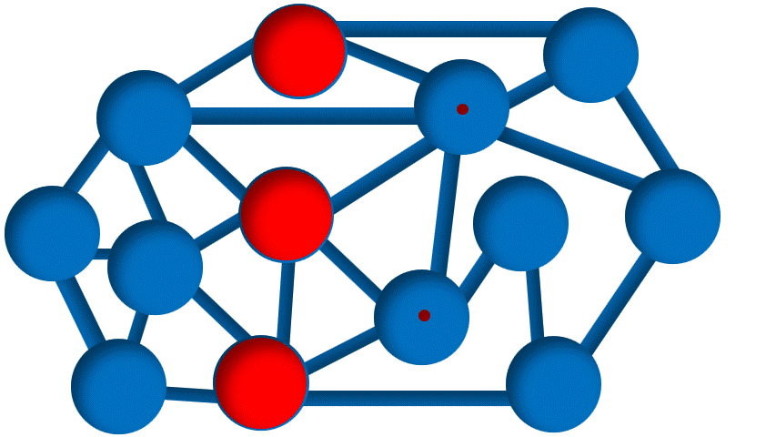
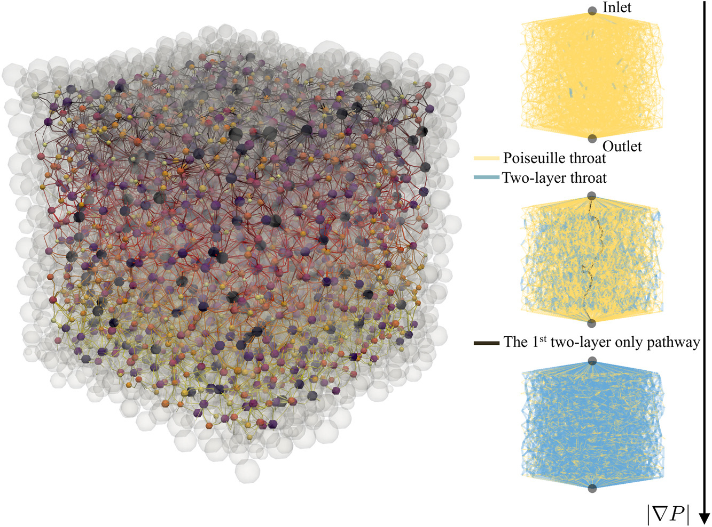
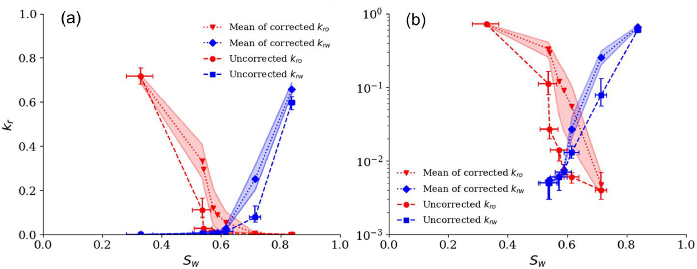
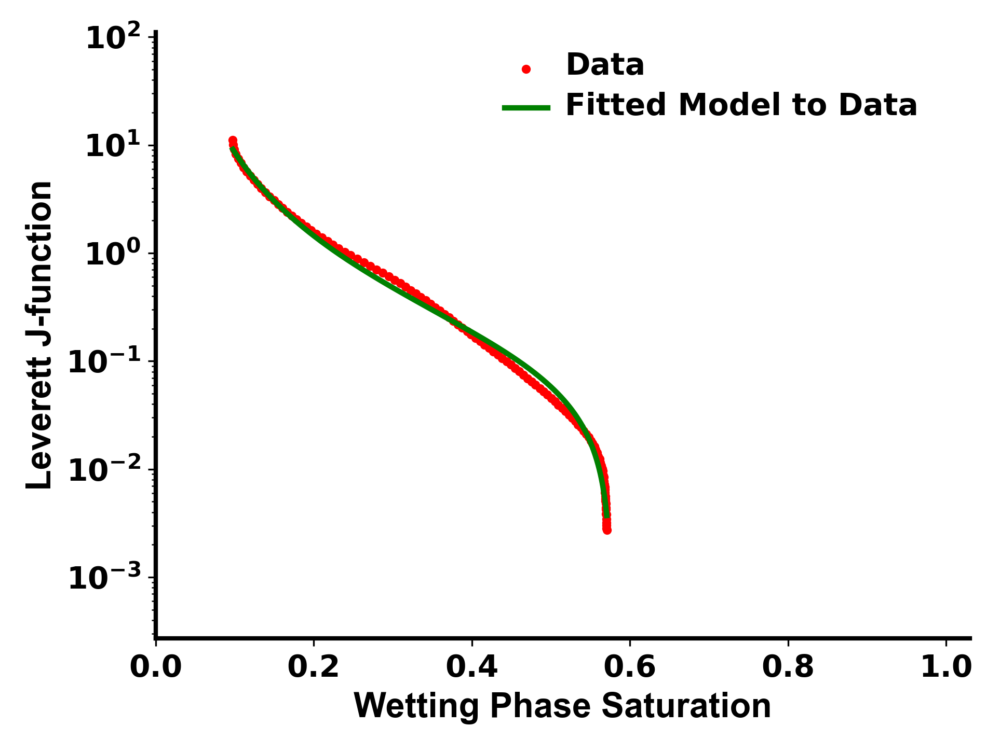
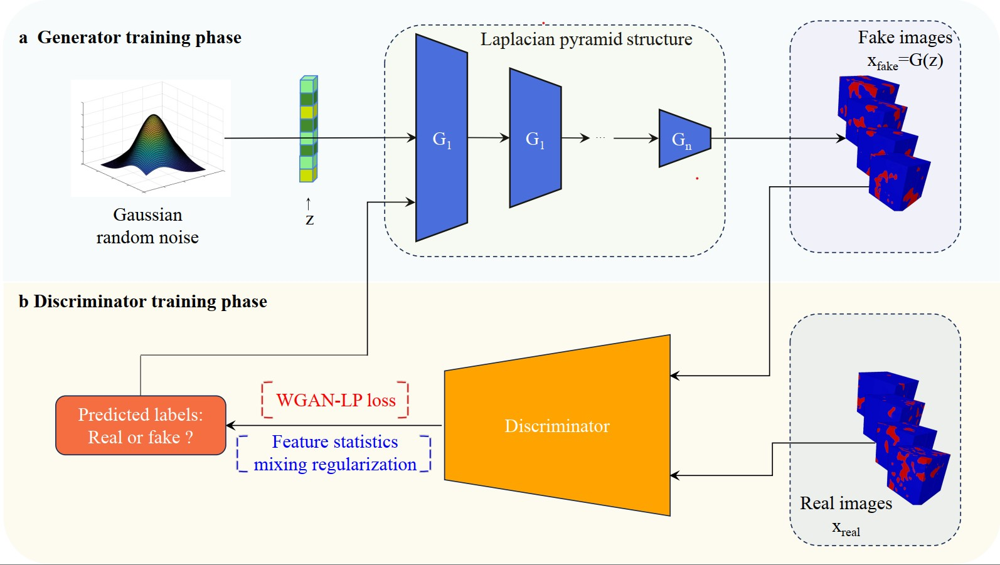

### Pore-Scale Modelling
Flow in porous media occurs is ubiquitous in natural and manufactured settings, from rainfall falling on soil and transpiration in plants, to filling a baby’s nappy and fluid exchange in electrochemical devices, such as electrolysers and fuel cells. Underground, most of the world’s fresh water is held in porous rock and soil, while deeper formations may contain oil and gas; otherwise the pore space is filled with salty water which can be displaced to store carbon dioxide or hydrogen.

The design and management of flow processes in porous media require accurate tools for analysis and modelling. The advent of micron-resolution three-dimensional X-ray imaging has allowed us to image the pore space and the fluids within it. However, how do we make sense of images that often contain 10s of billions of voxels?
This challenge is met through pore-scale modelling.

This repository has been established to facilitate access to all pore-scale modelling codes developed under the supervision of Professor **[Martin Blunt](https://www.imperial.ac.uk/people/m.blunt)** and Dr. **[Branko Bijeljic](https://www.imperial.ac.uk/people/b.bijeljic)** at Imperial College London. Below are the links to each of these repositories, complete with descriptions for each:

<!-- ### **Here are links to the individual code repositories:** ### -->
 
| Repository | Description |
|------------|-------------|
| 
**[pnextract](https://github.com/ImperialCollegeLondon/pnextract)** 
| 
 <strong>Pore Network Extraction from Micro-CT Images of Porous Media</strong>
 |
| 
**[PoreXtractor](https://github.com/ImperialCollegeLondon/poreOccupancyAnalysis)**
 | 
 <strong>Analysis Software for Quantification of Pore and Throat Occupancy in 3D Micro-CT Images</strong>
 |
| 
**[pnflow](https://github.com/ImperialCollegeLondon/pnflow)**
 | 
 <strong>Pore Network Flow Simulation</strong>
 |
| 
**[OstRipening](https://github.com/ImperialCollegeLondon/OstRipening )**
 | 
 <strong>Pore Network Flow for Ostwald Ripening Simulation </strong>
 |
| 
**[Pore-Network-Modeling-of-Polymer-Flows](https://github.com/ImperialCollegeLondon/Pore-Network-Modeling-of-Polymer-Flows )**
 | 
 <strong>Pore Network Flow for Non-Newtonian Flow Simulation </strong>
 |
| 
**[Porefoam1f](https://github.com/ImperialCollegeLondon/poreFoam-singlePhase)**
 | 
 <strong>Direct Numerical Simulation (DNS) of Incompressible Single Phase Flow on 3D Images of Porous Media Using OpenFOAM Finite-volume Library</strong>
 |
| 
**[Porefoam2f](https://github.com/ImperialCollegeLondon/porefoam)**
 | 
 <strong>Direct Numerical Simulation (DNS) of Incompressible Two-phase Flow on 3D Images of Porous Media Using OpenFOAM Finite-volume Library</strong>
 |
| 
**[ReactiveTransportAnalyser](https://github.com/ImperialCollegeLondon/ReactiveTransportAnalyser)**
 | 
 <strong>Reactive Transport Analyzer for Reactions in Pore scale</strong>
 |
| 
**[ContactAngle](https://github.com/ImperialCollegeLondon/ContactAngle)**
 | 
 <strong>Automatic Measurements of Contact Angle, Interfacial Curvature, and Surface Roughness in Pore-Scale 3D-Images</strong>
 |
| 
**[relPermCorrection](https://github.com/ImperialCollegeLondon/relPermCorrection)**
 | 
 <strong>A Novel Method That Corrects Steady-State Relative Permeability Calculations for Inhomogeneous Saturation Profiles Along the Flow Direction</strong>
 |
| 
**[TangentPcFit](https://github.com/ImperialCollegeLondon/TangentPcFit)**
 | 
 <strong>Implementing a Novel Capillary Pressure Model: Fitting Experimentally Measured Data Across Diverse Wettability Conditions</strong>
 |
| 
**[GGIECN](https://github.com/ImperialCollegeLondon/GGIECN)**
 | 
 <strong>Enhanced Intelligent Segmentation with Grey Scale Image Gradients</strong>
 |
| 
**[IPWGAN](https://github.com/ImperialCollegeLondon/IPWGAN)**
 | 
 <strong>Porous Media Generation</strong>
 |
| 
**[DDIM](https://github.com/ImperialCollegeLondon/DDIM)**
 | 
 <strong>Multiphase Images Generation</strong>
 |

---

---

## Pore-scale modules for code developers

This repository serves as developer guide for integrating different git 
codes/submodules linked here and contains no code of its own. 

The script [setup_from_scratch.sh](setup_from_scratch.sh) can be used to 
regenerate this repository from scratch. 

You need to 
[set up a ssh key](https://docs.github.com/en/github/authenticating-to-github/connecting-to-github-with-ssh) 
and add it to your Github account for the instructions here to work. 
Otherwise you can modify the git commands and replace the all the `git:` addresses 
with corresponding `https:` addresses, if you do not want to push your changes back 
to Github.

 ----------------------------------------------------------------

### See [doc](doc) folder and doc and README files in each modules directory for further details

 ----------------------------------------------------------------

### Cloning codes

----------------------------------------------------------------

To **clone all the modules at once**, which can be time-consuming to compile, run:

`git clone ----recurse-submodules git@github.com:ImperialCollegeLondon/porescale.git`

----------------------------------------------------------------

To cherry-pick the submodules, first **clone this repository:**

`git clone git@github.com:ImperialCollegeLondon/porescale.git`

or 

`git clone https://github.com/ImperialCollegeLondon/porescale.git`

and then **update the common modules:**

`git submodule update --init  src/script src/include pkgs/zlib pkgs/libtiff src/libvoxel`

Finally to get other codes run any combination of the following commands.

Pore-network model, **pnextract and pnflow:**

`git submodule update --init  pkgs/hypre src/pnm`

**Contact angle code:**

`git submodule update --init  pkgs/foamx4m src/ContAngle`

**Porefoam two-phase** flow solver:

`git submodule update --init  pkgs/foamx4m src/porefoam2f`

**Porefoam single-phase** flow solver:

`git submodule update --init  pkgs/foamx4m src/porefoam1f`

----------------------------------------------------------------

### Create from scratch

Instead of running the git commands above, you can run the contents of 
[setup_from_scratch.sh](setup_from_scratch.sh), to generate this 
repository from scratch.

----------------------------------------------------------------

### Build and test

Compilation requires gnu and cmake and a c++ compiler.  Compilation of porefoam and ContactAngle codes additionally requires libscotch-dev and openmpi-dev, in Ubuntu Linux.

Once you have the prerequisites installed, to compile the codes, run `make`, or `make -j` for parallel build. 

To test the compilation run `make test`.

----------------------------------------------------------------

### Contact and References ###

For contacts and references, please visit the individual modules or explore our research group's [Pore-Scale Modelling page](https://www.imperial.ac.uk/earth-science/research/research-groups/pore-scale-modelling).

Alternatively, contact **Sajjad Foroughi**:
- Email: s.foroughi@imperial.ac.uk
- Additional Email: foroughi.sajad@gmail.com

