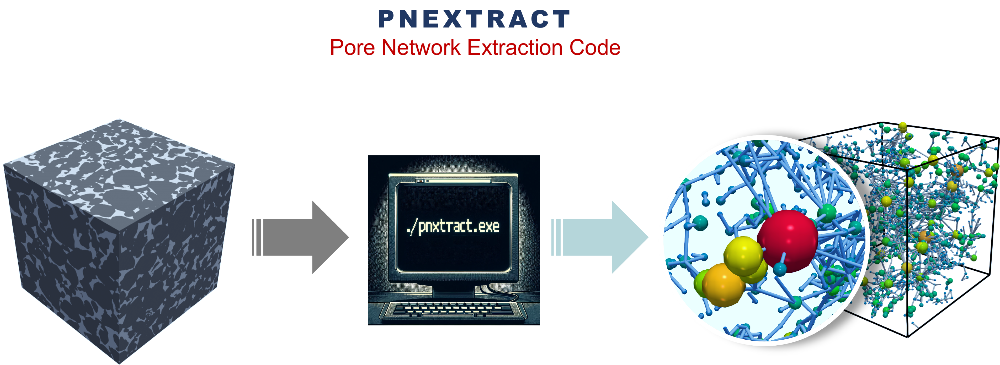
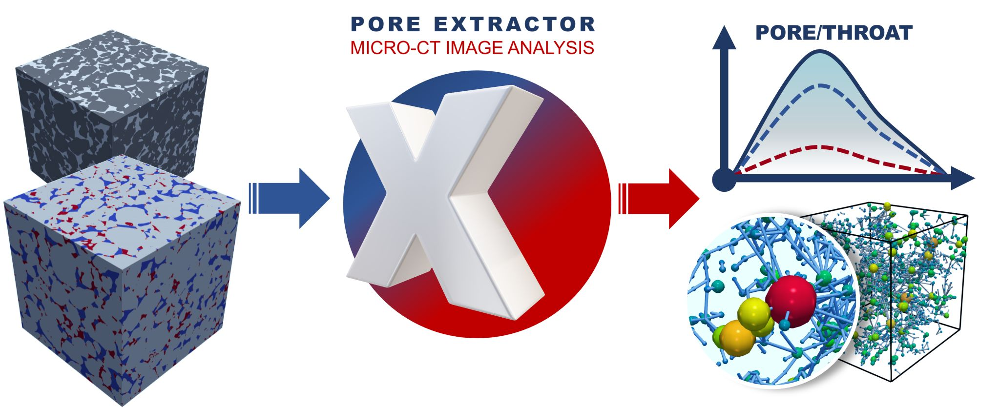
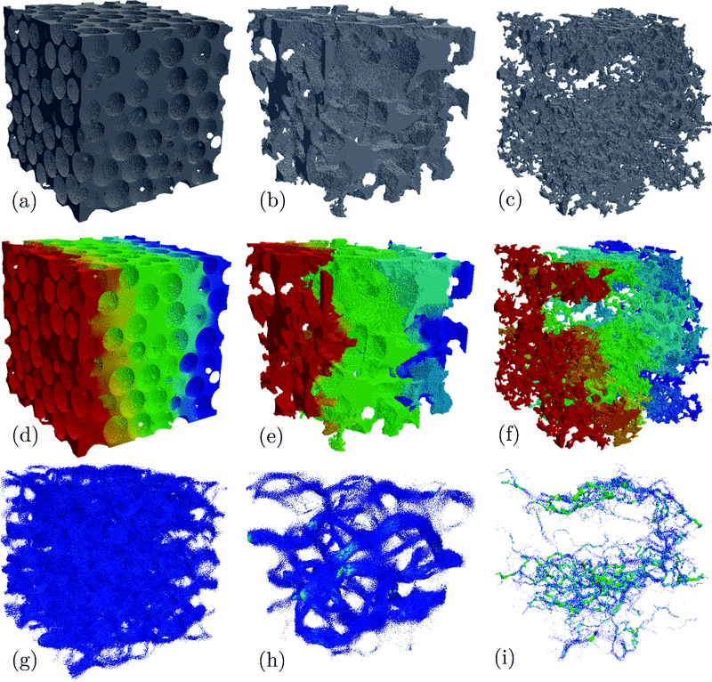
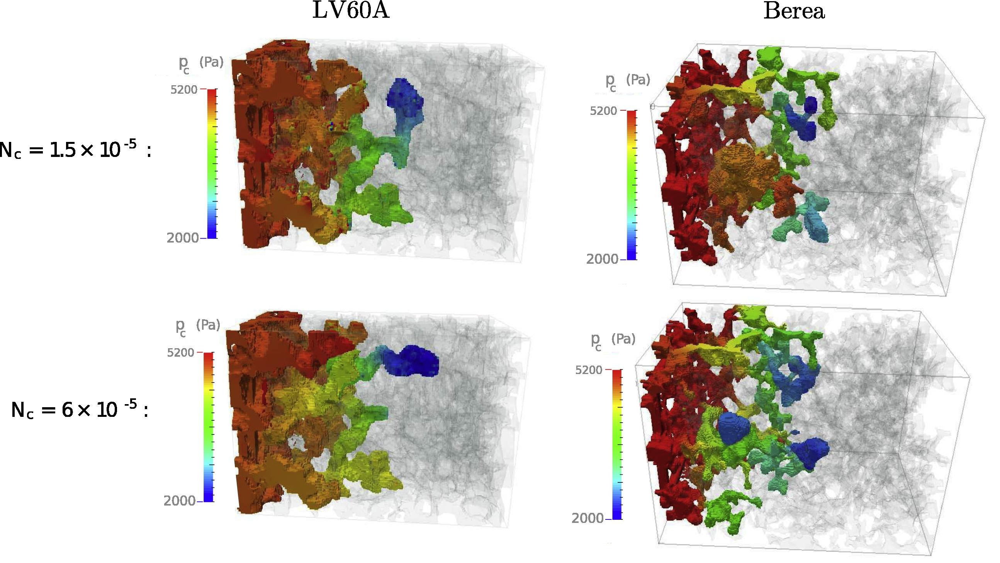
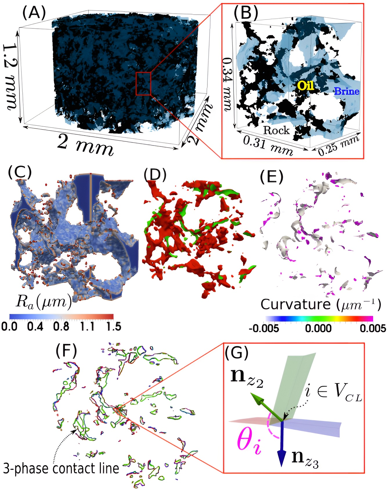
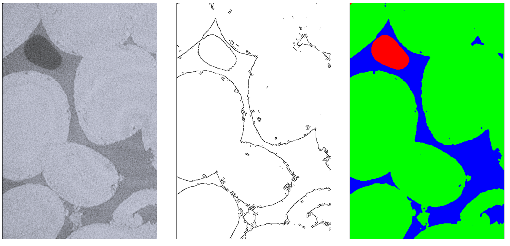

## Pore-scale modules for code developers

This repository serves as developer guide for integrating different git 
codes/submodules linked here and contains no code of its own. 

### **Here are links to the individual code repositories:** ###
 
| Repository | Description |
|------------|-------------|
| **[pnextract](https://github.com/ImperialCollegeLondon/pnextract)** | 
 <strong>Pore Network Extraction from Micro-CT Images of Porous Media</strong>
 |
| **[PoreXtractor](https://github.com/ImperialCollegeLondon/poreOccupancyAnalysis)** | 
 <strong>Analysis Software for Quantification of Pore and Throat Occupancy in 3D Micro-CT Images</strong>
 |
| **[pnflow](https://github.com/ImperialCollegeLondon/pnflow)** | 
 <strong>Pore Network Flow Simulation</strong>
 |
| **[Porefoam1f](https://github.com/ImperialCollegeLondon/poreFoam-singlePhase)** | 
 <strong>Direct Numerical Simulation (DNS) of Incompressible Single Phase Flow on 3D Images of Porous Media Using OpenFOAM Finite-volume Library</strong>
 |
| **[Porefoam2f](https://github.com/ImperialCollegeLondon/porefoam)** | 
 <strong>Direct Numerical Simulation (DNS) of Incompressible Two-phase Flow on 3D Images of Porous Media Using OpenFOAM Finite-volume Library</strong>
 |
| **[ContactAngle](https://github.com/ImperialCollegeLondon/ContactAngle)** | 
 <strong>Automatic Measurements of Contact Angle, Interfacial Curvature, and Surface Roughness in Pore-Scale 3D-Images</strong>
 |
| **[relPermCorrection](https://github.com/ImperialCollegeLondon/relPermCorrection)** | 
 <strong>A Novel Method That Corrects Steady-State Relative Permeability Calculations for Inhomogeneous Saturation Profiles Along the Flow Direction</strong>
 |
| **[GGIECN](https://github.com/ImperialCollegeLondon/GGIECN)** | 
 <strong>Enhanced Intelligent Segmentation with Grey Scale Image Gradients</strong>
 |

The script [setup_from_scratch.sh](setup_from_scratch.sh) can be used to 
regenerate this repository from scratch. 

You need to 
[set up a ssh key](https://docs.github.com/en/github/authenticating-to-github/connecting-to-github-with-ssh) 
and add it to your Github account for the instructions here to work. 
Otherwise you can modify the git commands and replace the all the `git:` addresses 
with corresponding `https:` addresses, if you do not want to push your changes back 
to Github.

 ----------------------------------------------------------------

### See [doc](doc) folder and doc and README files in each modules directory for further details

 ----------------------------------------------------------------

### Cloning codes

----------------------------------------------------------------

To **clone all the modules at once**, which can be time-consuming to compile, run:

`git clone ----recurse-submodules git@github.com:ImperialCollegeLondon/porescale.git`

----------------------------------------------------------------

To cherry-pick the submodules, first **clone this repository:**

`git clone git@github.com:ImperialCollegeLondon/porescale.git`

or 

`git clone https://github.com/ImperialCollegeLondon/porescale.git`

and then **update the common modules:**

`git submodule update --init  src/script src/include pkgs/zlib pkgs/libtiff src/libvoxel`

Finally to get other codes run any combination of the following commands.

Pore-network model, **pnextract and pnflow:**

`git submodule update --init  pkgs/hypre src/pnm`

**Contact angle code:**

`git submodule update --init  pkgs/foamx4m src/ContAngle`

**Porefoam two-phase** flow solver:

`git submodule update --init  pkgs/foamx4m src/porefoam2f`

**Porefoam single-phase** flow solver:

`git submodule update --init  pkgs/foamx4m src/porefoam1f`

----------------------------------------------------------------

### Create from scratch

Instead of running the git commands above, you can run the contents of 
[setup_from_scratch.sh](setup_from_scratch.sh), to generate this 
repository from scratch.

----------------------------------------------------------------

### Build and test

Compilation requires gnu and cmake and a c++ compiler.  Compilation of porefoam and ContactAngle codes additionally requires libscotch-dev and openmpi-dev, in Ubuntu Linux.

Once you have the prerequisites installed, to compile the codes, run `make`, or `make -j` for parallel build. 

To test the compilation run `make test`.

----------------------------------------------------------------

### Contact and References ###

For contacts and references, please visit the individual modules or explore our research group's [Pore-Scale Modelling page](https://www.imperial.ac.uk/earth-science/research/research-groups/pore-scale-modelling).

Alternatively, contact Sajjad Foroughi:
- Email: s.foroughi@imperial.ac.uk
- Additional Email: foroughi.sajad@gmail.com

